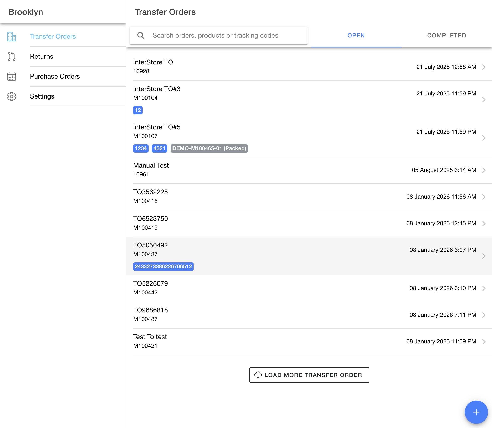
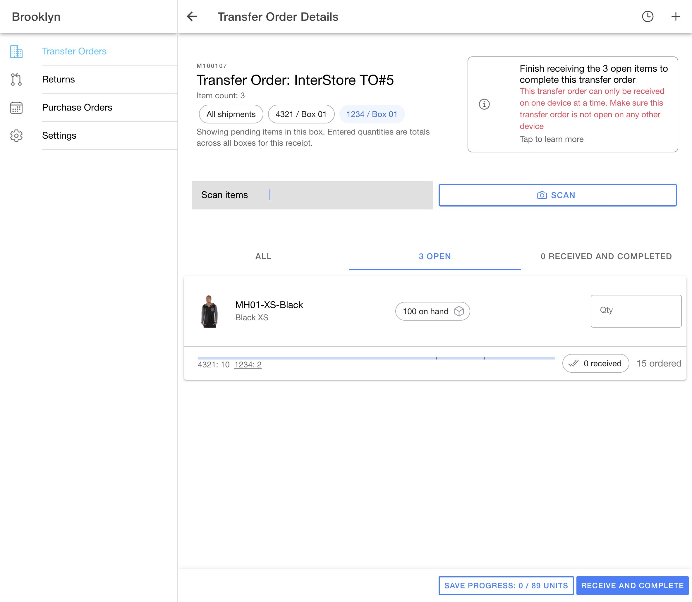

# Receiving login without an AccxUI change — October 1, 2026

## Result

Receiving now starts its local cache after its own `postLogin` setup completes. It can run on the existing demo checkout without the shared auth change in AccxUI PR #194.

The shared `common/composables/useAuth.ts` file was restored to the original AccxUI `2e4a524` version before all checks below. `git diff --exit-code -- common/composables/useAuth.ts` confirmed no local implementation change. No backend code, API contract, or deployment was changed.

## App change

- Beginning login suspends the previous Receiving cache connection.
- Successful profile, permission, facility, product-store, and notification setup marks Receiving ready. Failed setup never marks it ready.
- Cache configuration uses a fresh evaluation of the existing shared authentication check, as the route guard already does. It retains expiry, OMS, and profile checks without relying on a computed evaluated before the user-ID cookie arrived.
- Reloaded authenticated sessions resume from cache. Facility changes and token renewal retain the existing configuration and synchronization flow.

This Receiving-only login fix also passed repeat validation on current AccxUI. The separate database migration is now complete; see the [current AccxUI compatibility and receipt QA](2026-10-01-current-accxui.md).

## Verification

- `pnpm --filter receiving test:unit run --cache=false`: all 28 tests passed, including three new tests covering token-first login/re-login, incomplete login, saved-session resume, facility changes, token expiry, and mismatched profiles.
- `pnpm --filter receiving build`: passed in 12.23 seconds, with the existing bundle-size warning.
- AccxUI Ionic UI-diff checker and whitespace checks passed.
- Real Demo Maarg, Brooklyn: signed in with the saved Keychain account and reached the populated transfer list.
- Used Settings → Logout and signed in again in the same tab, without reloading. The transfer list populated without the previous “Loading saved transfers…” stall.
- Reloaded the authenticated transfer list. Saved transfers appeared immediately while a background refresh ran.
- Searched for `1234` and pressed Enter. M100107 opened with box `1234 / 01` selected, only its pending item visible, and the product scanner focused.
- This verification created no receipts or tracking changes. M103418/M103489 and the reserved demo quantities were untouched.

The older shared logout implementation logged `resp.data.startsWith is not a function` for the Demo response but still cleared the session and returned to the usable login form. This existing shared response-handling issue was not changed or counted as fixed.

## UI evidence

