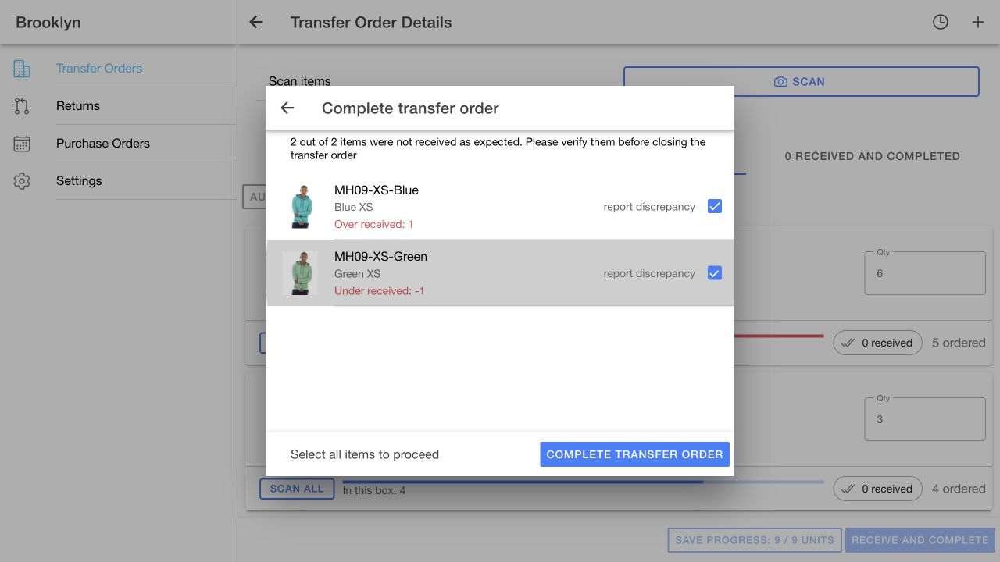
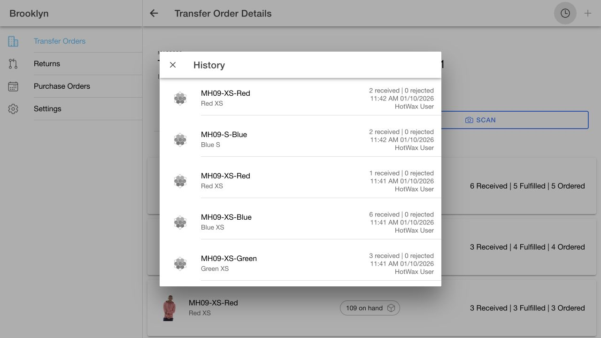

# Current AccxUI compatibility and receiving QA — October 1, 2026

## Scope

The earlier PR #739 build blocker is resolved in Receiving. Validation used unmodified AccxUI `c91b85dbcbcc74fad454a38bf64615a2ff30ad9c`, the Receiving publication branch based on `f3ddded`, and the user's restarted local Receiving app on port 8100 against Demo Maarg / Brooklyn. The live checkout's feature source matches the publication branch. No shared AccxUI or backend changes are needed.

## Compatibility changes

- Import shared storage helpers from `common/db/storage` and use `defineEntity` for header projection. Explicitly retain source header fields because the new projection no longer returns `raw`; nested items remain separate.
- Use `createSyncHarness`, class A registration with a 30-second interval, and object domain activation. Receiving request-token updates remain scoped to the active worker through its existing RPC.
- Upgrade existing version 1/2 caches to version 3 in place and record the shared `schemaVersion` before the harness initializes. Existing transfer data and uncertain-receipt guards survive. A fresh database records the marker during population; logout clears user data while retaining that marker.
- Open and validate storage before the shared rebuild helper runs. Unexpected metadata or open failures stop initialization rather than erase unresolved receipt state.

## Validation

- Production builds passed in the live checkout (11.58 seconds) and publication checkout (12.83 seconds), both against AccxUI `c91b85d`.
- 35 unit tests passed across 9 files in both checkouts. Publication commands supplied the existing nonsecret `VITE_APP_VERSION_CONFIG='{"buildVersion":""}'` configuration.
- 62 assertions passed in real-browser isolated IndexedDB/store checks: 23 new migration checks, 20 cache checks, 11 shipment checks, and 8 draft checks. These use disposable local databases, not mocked OMS APIs. Tests are in `tests/receivingMigration.browser.ts`, `receivingDatabase.browser.ts`, `receivingShipments.browser.ts`, and `receivingDrafts.browser.ts`.
- Migration coverage includes fresh, v1, and v2 databases; facility multi-entry indexes; package status migration; preservation of an uncertain receipt; a second worker realm running the actual shared readiness helper; reopen; logout/re-login metadata; and failure without deletion when the marker is missing unexpectedly.
- Live logout and Keychain-backed re-login loaded the Open list without requiring a reload. A later warm reload displayed saved transfers while the worker refreshed.
- Empty search displayed “No results found.” Exact tracking + Enter opened M103572 with its third box selected, 14 matching item lines, and scanner focus. All three presentation transfers remained available.
- A fresh transfer created through the existing APIs appeared through background synchronization, proving current shared harness activation. Completed-ID search and completed receipt history also passed.
- `vue-tsc --noEmit` still reports 28 pre-existing diagnostics in `SelectFacilityModal.vue`, `ReturnDetails.vue`, and `transferOrderDetailReceiveWorkflow.spec.ts`. These files are unchanged from Receiving main; no diagnostics occur in the new database integration. The declared production build and GitHub workflow use Vite build. Bundle-size warnings remain.

## Real receipt test: M103622

Dedicated QA transfer **M103622** has four lines with issued quantities 5/4/3/2. Shipment M102908 carries tracking `1Z8R42A90374481001`; M102909 carries `1Z8R42A90374481002`. The first product spans both boxes. Presentation transfers M103571–M103573 were not received during this test.

1. Tracking search opened the first box and showed only its two lines. Per-item **Scan all** filled 5, then **Auto scan all** filled the other line with 4. An authoritative order read confirmed received quantities remained zero.
2. Entering 6 and 3 exercised over-receiving by 1 and under-receiving by 1. Completion stayed disabled until both discrepancies were acknowledged. Submitting completed only these two lines; the other two stayed pending at zero and the header stayed approved.
3. In the second box, **Save progress** received one unit on line 00003, keeping it pending. Reopening showed one received and four units remaining across the two open lines.
4. **Auto scan all** filled only the remaining 2 + 2. The existing completion confirmation submitted them and completed the order. It disappeared from Open and appeared in Completed when searched by M103622.
5. Completed detail showed 6/3/3/2 received; history showed five groups from the three submissions, newest first, with receiver enrichment and no duplicate receipts.

Authoritative Brooklyn inventory readback:

| Product | Before UI receipts | After filtered variance receipt | Final | Total delta |
| --- | ---: | ---: | ---: | ---: |
| 10001 | 130 | 136 | 136 | +6 |
| 10002 | 108 | 111 | 111 | +3 |
| 10003 | 106 | 106 | 109 | +3 |
| 10004 | 104 | 104 | 106 | +2 |

All lines are `ITEM_COMPLETED`; the order is `ORDER_COMPLETED`. Shortage does not add inventory or rejected quantity. Box filters select order lines; a split line still receives its aggregate quantity across boxes, as the UI explains.

## Remaining review boundary

This is implementation and QA evidence, not a merge or deployment. GitHub's current checks and required reviewer approval remain the authority for merge eligibility. Completed transfers stay server-paged; historical tracking search covers hydrated packages. No new cold-load performance guarantee is claimed.
