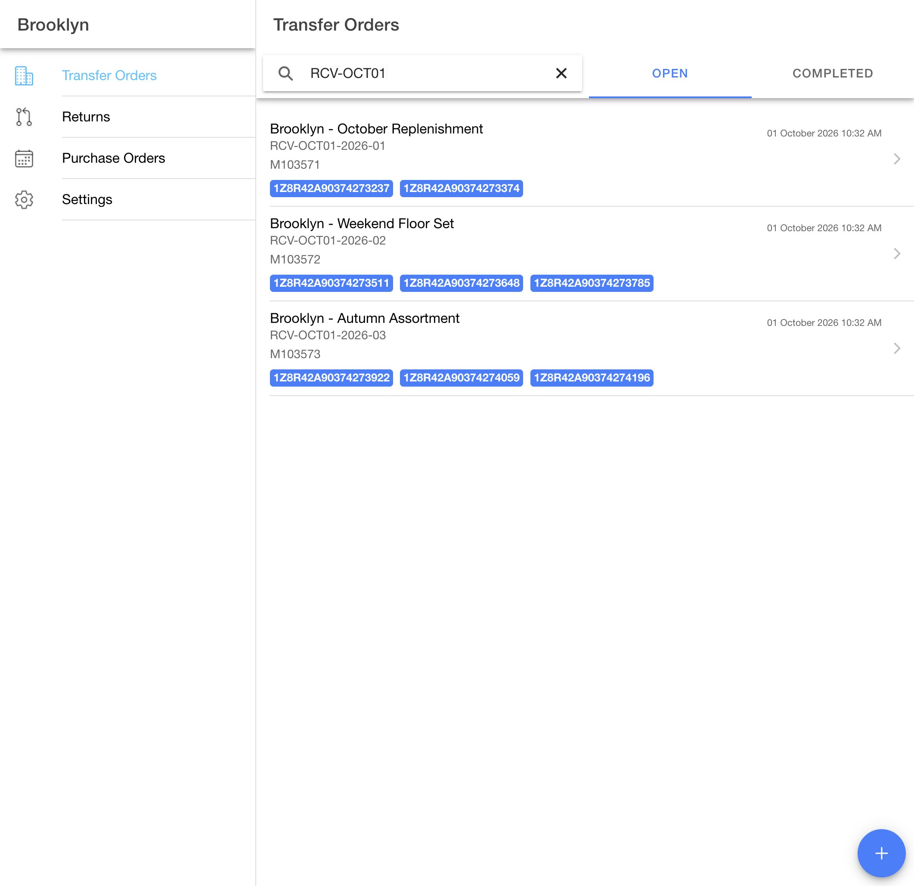
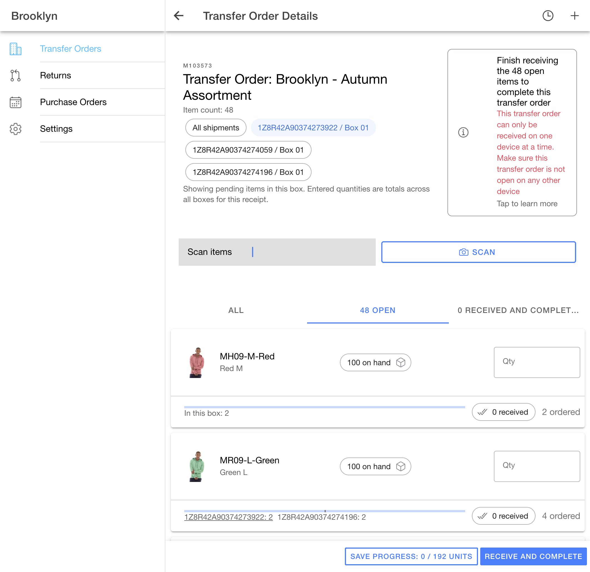
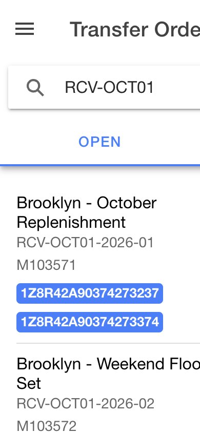

# Receiving demo transfers — October 1, 2026

Created through the existing Demo Maarg APIs for Central Warehouse → Brooklyn. These are new warehouse-fulfilled transfers using `TO_Receive_Only`; all lines remain pending receipt. Tracking numbers are synthetic parcel-style demo values, not purchased carrier labels.

| Transfer | Name | Item lines | Units | Shipments | Packages |
| --- | --- | ---: | ---: | ---: | ---: |
| M103571 | Brooklyn - October Replenishment | 24 | 96 | 2 | 2 |
| M103572 | Brooklyn - Weekend Floor Set | 36 | 144 | 2 | 3 |
| M103573 | Brooklyn - Autumn Assortment | 48 | 192 | 3 | 3 |

The 108 distinct catalog variants have existing images, SKUs, and scan identifiers. Source warehouse QOH and ATP covered all planned quantities before creation. Several lines span two boxes; a six-unit line in each three-box transfer spans all three boxes, two units per box.

## Demo entry points

Search `RCV-OCT01` in the Open tab to show just these three transfers.

| Transfer | Shipment | Box | Tracking code | Lines in box | Units in box |
| --- | --- | --- | --- | ---: | ---: |
| M103571 | M102879 | 01 | 1Z8R42A90374273237 | 15 | 41 |
| M103571 | M102880 | 01 | 1Z8R42A90374273374 | 13 | 55 |
| M103572 | M102881 | 01 | 1Z8R42A90374273511 | 14 | 48 |
| M103572 | M102881 | 02 | 1Z8R42A90374273648 | 13 | 48 |
| M103572 | M102882 | 01 | 1Z8R42A90374273785 | 14 | 48 |
| M103573 | M102883 | 01 | 1Z8R42A90374273922 | 18 | 64 |
| M103573 | M102884 | 01 | 1Z8R42A90374274059 | 17 | 64 |
| M103573 | M102885 | 01 | 1Z8R42A90374274196 | 18 | 64 |

Paste a tracking code into the list search and press Enter to open that transfer and select its box. The [packing list](demo-transfer-packing-list.csv) contains every item, quantity per box, SKU, and scan code. For example, `MH09MRed` identifies the two-unit red hoodie line in M103573 / M102883 / Box 01.

## Verification

- Created each order with `POST /rest/s1/oms/transferOrders`, approved with its `approveWhFulfill` endpoint, and imported the warehouse's shipped packages through `POST /rest/s1/poorti/transferShipments`.
- Authoritative GET readbacks verified every order line, product, quantity, shipment, package, and tracking code. All seven shipments are `SHIPMENT_SHIPPED`; all 108 order lines are `ITEM_PENDING_RECEIPT`, issued quantities equal ordered quantities, and received quantities are zero.
- Browser: all three orders and all eight tracking badges appear in the Open tab. Exact tracking search + Enter opens the corresponding detail and selects the matching box, with scanner focus.
- M103572: the third tracking code opens its final shipment, selects its box, and displays the expected 14 rows. All three package chips are present after synchronization.
- M103573: all three box chips are present. Selecting the second box displays 17 rows; selecting All shipments displays 48 rows. Split-box quantities appear in the Ionic progress display.
- Native list markup: internal ID is a direct `p` child of `ion-label`; date uses `ion-note slot="end"`. The custom summary layout was removed. Desktop and 390×844 viewport checks passed; the mobile page has no horizontal overflow.
- Receiving production build and AccxUI UI/diff checks passed on the existing demo wrapper baseline. These follow-ups do not change the separate latest-AccxUI database compatibility limitation recorded in the PR.
- No receipts were submitted for these new orders during verification. No server code or API deployment was performed.

## Earlier package tracking cleanup

Five earlier demo package placeholders were also replaced. Readback verified that the only changed response fields were tracking-related; shipment/order statuses, dates, and package contents/quantities were preserved.

| Transfer | Shipment / box | New tracking code |
| --- | --- | --- |
| M100104 | M100060 / 01 | 1Z8R42A90374182605 |
| M100107 | M100062 / 01 | 1Z8R42A90374182614 |
| M100107 | M100463 / 01 | 1Z8R42A90374182623 |
| M100107 | M100465 / 01 | 1Z8R42A90374182632 |
| M100867 | M100767 / 01 | 1Z8R42A90374182641 |
