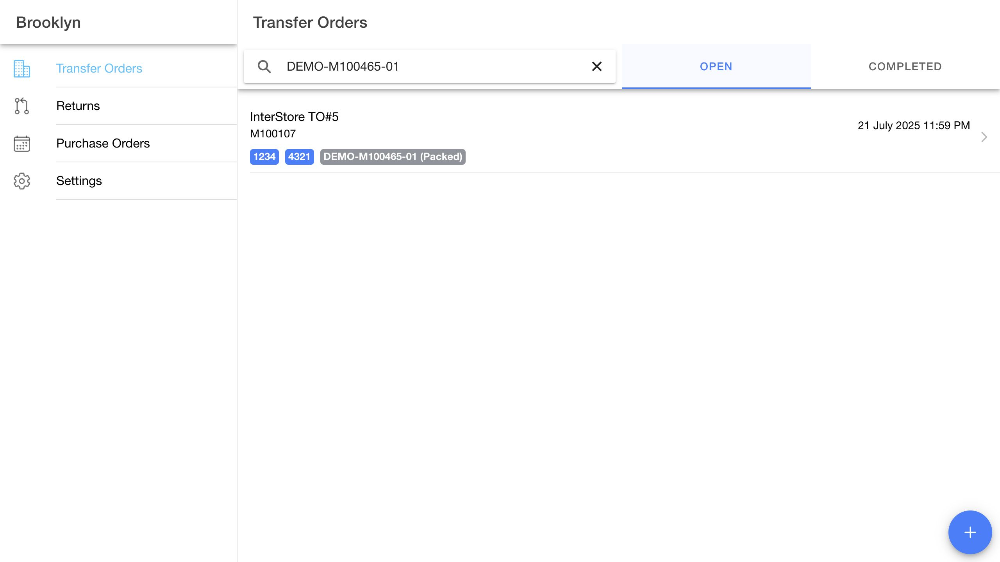
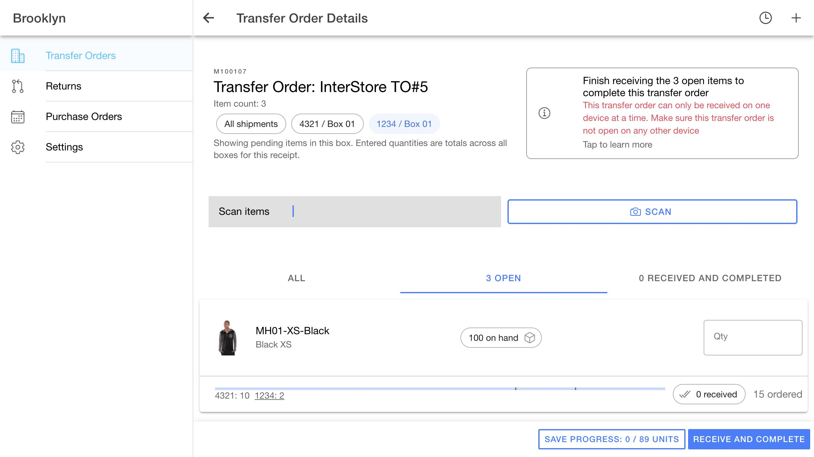
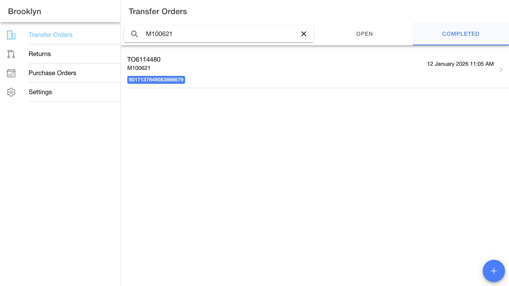
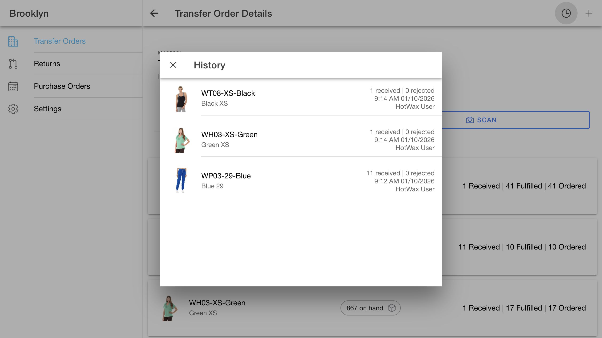

# Receiving local data and shipment QA — October 1, 2026

## Scope and integration status

Real UI and API checks used Demo Maarg at Brooklyn. The tested checkout combined Receiving `7fd8a25` and AccxUI `2e4a524` with the local Receiving implementation and shared reactive user-ID auth fix. The deployed comparison was Receiving 4.2.1. No backend services, API contracts, or deployment were changed.

Later the same day, the shared auth edit was removed and Receiving adopted an app-owned login lifecycle. Fresh login, logout/re-login, saved-session reload, and tracking navigation passed with unchanged AccxUI auth. Receiving no longer depends on AccxUI PR #194. See the [Receiving-only login follow-up](2026-10-01-app-local-login.md).

The publication branch starts from Receiving `f3ddded`. An integration build against AccxUI main `c91b85d` **fails** because the shared database framework changed after the tested baseline. Merging remains blocked until this migration and repeat validation are complete:

- `common/db/baseDb` and `common/db/projection` moved under `common/db/storage`.
- `EntityProjection` was removed in favor of the current `Entity` contract.
- `createPollingWorkerHarness` was replaced by `createSyncHarness`; domain registration, intervals, and token updates have different contracts.
- Current `ensureDbReady` uses declared schema versions and may rebuild the cache. The existing Receiving v1-to-v2 migration and preservation behavior must be reconciled with that lifecycle.

The attempted integration command was `VITE_APP_VERSION_CONFIG='{"buildVersion":""}' pnpm --filter receiving build`. It failed resolving `common/db/baseDb` from `receivingDatabase.ts`. The successful tests below apply to the tested baseline unless explicitly stated otherwise. They do not establish compatibility with current AccxUI main.

## Receiving and inventory verification

Receipt writes were submitted through the app and checked against authoritative order, receipt, and inventory reads.

| Transfer | Action | Observed outcome |
| --- | --- | --- |
| M100107 | Save Progress, line 02 / product 10577, quantity 1 | Transfer remained pending; accepted quantity and QOH increased by 1. |
| M100867 | Receive and Complete, line 02 / product 10809, quantity 17 | Header and line completed; QOH changed from 755 to 772. |
| M100621 / TO6114480 | Save Progress, line 03 / product 10809, quantity 11 against 10 ordered/fulfilled | Overage acknowledgement required; line completed, header remained approved; QOH 772 to 783. |
| M100621 / TO6114480 | Receive and Complete, line 02 / product 10085, quantity 1 against 41 | Shortage 40 acknowledgement required; QOH 761 to 762. |
| M100621 / TO6114480 | Same completion, line 04 / product 10195, quantity 1 against 17 | Shortage 16 acknowledgement required; QOH 866 to 867. |

For the final completion, the native Ionic submit button stayed disabled after only one shortage acknowledgement and enabled after both. Final M100621 status was `ORDER_COMPLETED`; line totals were 1, 11, and 1, with exactly three receipt groups and zero rejected units. Cancelled line 01 remained unchanged. Shortages did not become inventory or rejected quantities.

IndexedDB readback showed `pendingReceiptFacilityIds=[]`, correct accepted totals, and `receiptReadback.pending=false`. Completed detail and history showed all three receipts with no receipt footer. Inventory remains live: a later UI read for product 10085 showed 758; the values above are immediate before/after receipt checks, not a claim that QOH remained unchanged afterward. The later movement was not investigated in this test.

M100416, whose item was in `ITEM_PENDING_FULFILL`, was rejected with HTTP 400 by both local and deployed Receiving. That invalid status flow is an existing backend limitation; no receipt was created. The reserved October demo transfers M103418/M103489 and reserved products 10362/10363 were not received or otherwise mutated by these tests.

## Tracking and box filtering

Tracking was added using the existing shipment-tracking API:

| Transfer | Shipment / package / route | Tracking code | Shipment status preserved |
| --- | --- | --- | --- |
| M100107 | M100465 / 01 / 01 | DEMO-M100465-01 | SHIPMENT_PACKED |
| M100867 | M100767 / 01 / 01 | DEMO-M100767-01 | SHIPMENT_APPROVED |

The existing service also updates the route carrier-service status and tracking reference. These metadata updates did not create receipts or change inventory. Existing shipped codes `4321` and `1234` were preserved.

- Pending-list badges and local text search found tracking codes, including packed shipments with their status labelled.
- Exact `1234` plus Enter opened M100107 with its shipped box selected and scanner focused. Partial, unknown, and ambiguous codes do not automatically navigate. Ambiguity was verified in an isolated IndexedDB test.
- Box `4321` showed three pending lines; box `1234` showed only line 01. Product 10362 had allocations of 10 and 2 against 15 ordered, with separators at 10/15 and 12/15 on the Ionic progress bar.
- Scans in the selected box incremented the correct line. Switching boxes preserved drafts; a scan belonging to another box was rejected without incrementing. Test draft quantities were cleared through the UI without an additional receipt.
- Exact completed tracking search found M100867 after its archive row was hydrated. Completed tracking search covers cached/visited packages, not the entire historical archive.
- Desktop and 390×844 layouts were checked for tracking wrapping, scanner focus, horizontal overflow, and content above the fixed footer.

The API records receipts at order-line level. Package separators represent shipment allocations and aggregate line receipt progress; they do not imply historic per-box receipt quantities.

## Regression checks

| Finding | Fix and evidence |
| --- | --- |
| Re-login stalled at “Loading saved transfers…” | The separate AccxUI auth fix makes user-ID changes reactive after token-first login. Normal logout/login loaded Brooklyn transfers without reload. |
| Failed list refresh blocked detail/history | Independent scheduling and retry state preserve detail/history/package refresh during membership failure. Fault-injection unit tests cover these failures; no live outage was manufactured. |
| Completed cache lacked automatic revalidation | Active completed detail/history joins background polling and checks the existing two-minute TTL. M100867 timestamps advanced automatically while the same page remained open, with no navigation or manual refresh. |
| Empty search wording | A nonempty no-match search displays “No results found”; clearing it restores the list. |
| Completed order ID search returned nothing | Removed the redundant `orderName` constraint. The live API returned zero for combined `orderName=M100621&keyword=M100621`, and one for `keyword=M100621`. Completed ID search now finds the order; clearing the search reloads the archive. |

## Automated validation

- Tested baseline: 25 Receiving unit tests passed; 4 shared auth/session tests passed.
- 39 browser assertions passed in isolated client databases/stores: migration, atomic snapshots, session isolation, tracking uniqueness, destination scope, queue fencing, live queries, and draft retention. These are storage checks, not mocked OMS acceptance.
- Tested baseline: Receiving production build and the AccxUI Ionic UI-diff checker passed. The existing bundle-size warning remains.
- Type checking still reports existing errors in `SelectFacilityModal.vue`, `ReturnDetails.vue`, and `transferOrderDetailReceiveWorkflow.spec.ts`; no new cache/tracking/detail errors were reported on the tested baseline.
- Publication check on AccxUI `c91b85d` plus the auth fix: `pnpm exec vitest run --root common/tests useAuth.spec.ts sessionScope.spec.ts --cache=false` passed all 4 tests.
- Publication integration build: failed as described above. Full latest-main Receiving validation is outstanding.

## UI evidence

