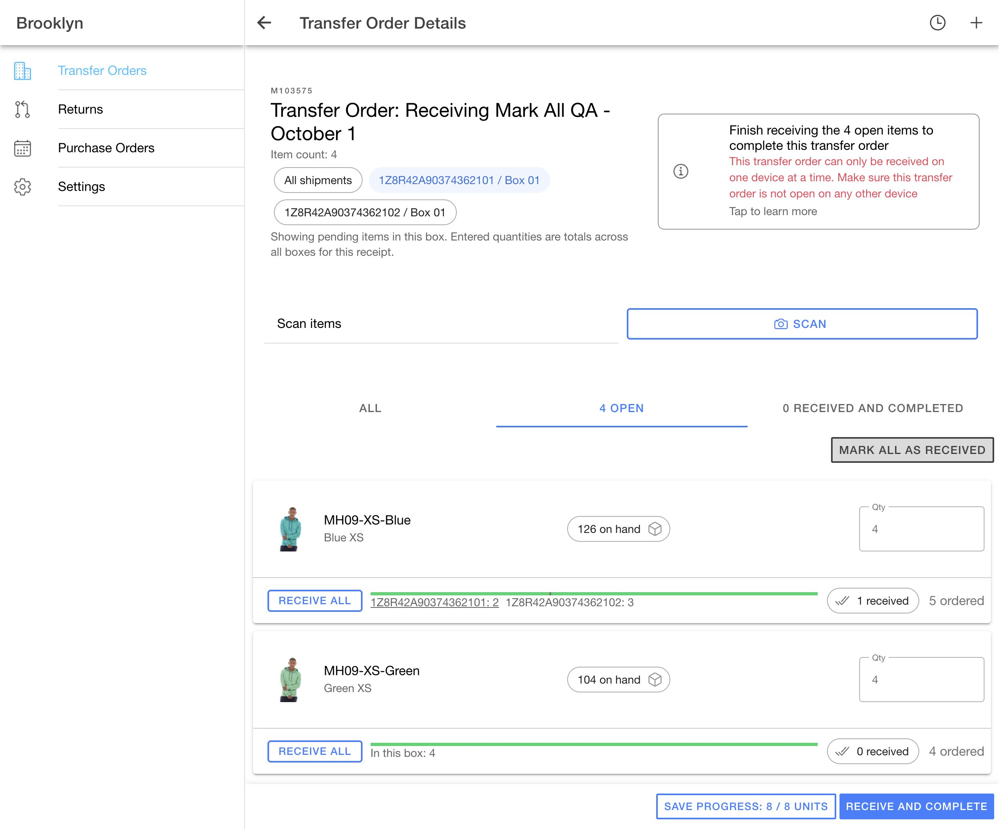
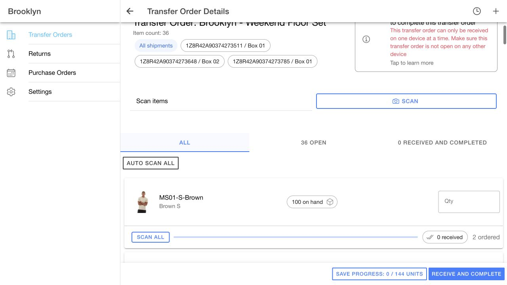

# Mark all as received QA — October 1, 2026

## Scope and runtime

Receiving-only follow-up on PR #739, tested at `http://localhost:8101` against Demo Maarg, Brooklyn, with AccxUI `2e4a524`. No shared AccxUI or server changes.

The order-level **Mark all as received** action fills the visible open lines with `totalIssuedQuantity - totalReceivedQuantity`. It does not submit a receipt. The existing **Receive and complete** and **Save progress** controls submit the selected tracking scope. Individual **Receive all** buttons remain available in both All and Open, including when a tracking code is selected.

Tracking filters select order lines. A line shared by several boxes still uses its remaining issued total across those boxes, as the detail screen explains. Hidden lines and their drafts are preserved.

## Real Demo verification

A dedicated QA transfer, **M103575**, was created using existing APIs. The three presentation transfers M103571–M103573 were not received during this test.

- Four lines: 10001/5 units, 10002/4 units, 10003/3 units, 10004/2 units.
- First shipped package: M102892/01, tracking `1Z8R42A90374362101`, line 00001 × 2 and line 00002 × 4.
- Second shipped package: M102893/01, tracking `1Z8R42A90374362102`, line 00001 × 3, line 00003 × 3, line 00004 × 2.
- Setup receipt: one unit on line 00001; all four lines remained pending.

Verified in the live browser:

1. Entered a draft of 1 on line 00003, then selected the first tracking code. Only lines 00001 and 00002 were shown.
2. The item-level **Receive all** button filled line 00001 with 4. **Mark all as received** filled line 00002 with 4 and left the screen open at 8/8 units.
3. Authoritative order readback confirmed neither marking action changed received quantities or statuses.
4. **Receive and complete** kept the tracking filter and explained that only visible items would complete. Cancel retained the filter and both drafts; backend readback remained unchanged.
5. Confirming the receipt completed lines 00001 and 00002 with cumulative received quantities 5 and 4. Lines 00003/00004 remained pending at zero. The order remained approved.
6. Returning through the list preserved line 00003's hidden draft of 1.
7. In All, **Mark all as received** filled the remaining lines with 3 and 2, skipping the two completed lines. The existing completion flow then completed the order.
8. The transfer disappeared from Open, appeared in Completed, and the completed detail showed received quantities 5/4/3/2 with no further receiving controls.

Authoritative inventory readbacks:

| Product | Before UI receipts | After filtered receipt | After final receipt |
| --- | ---: | ---: | ---: |
| 10001 | 126 | 130 | 130 |
| 10002 | 104 | 108 | 108 |
| 10003 | 103 | 103 | 106 |
| 10004 | 102 | 102 | 104 |

The QOH deltas exactly matched the submitted quantities: +4/+4 for the filtered receipt and +3/+2 for the final receipt.

An earlier dedicated transfer, M103574, was also completed during development. Final UI behavior was validated against M103575 after the marking-only adjustment.

## Final button labels and alignment

After functional QA, the header shortcut was renamed **Auto scan all** and moved to the left. The per-item shortcut was renamed **Scan all** in both All and Open. A live browser check on M103572 verified both labels. These edits change presentation only: shortcuts fill quantities, while the existing footer submits receipts. The earlier functional screenshot above preserves the labels used during the receipt test.

## Checks and limits

- All 35 unit tests passed (9 files), including remaining-issued calculations, hidden draft preservation, failed-submission draft retention, and duplicate-submit locking.
- Production build passed on the demo wrapper (10.71 seconds).
- AccxUI UI diff checker and whitespace checks passed.
- Initial browser control on the existing tab timed out. A fresh in-app tab restored control; live QA was completed there.
- The PR's latest-AccxUI database integration limitation remains; this demo validation does not establish compatibility with the newer shared database contracts.
