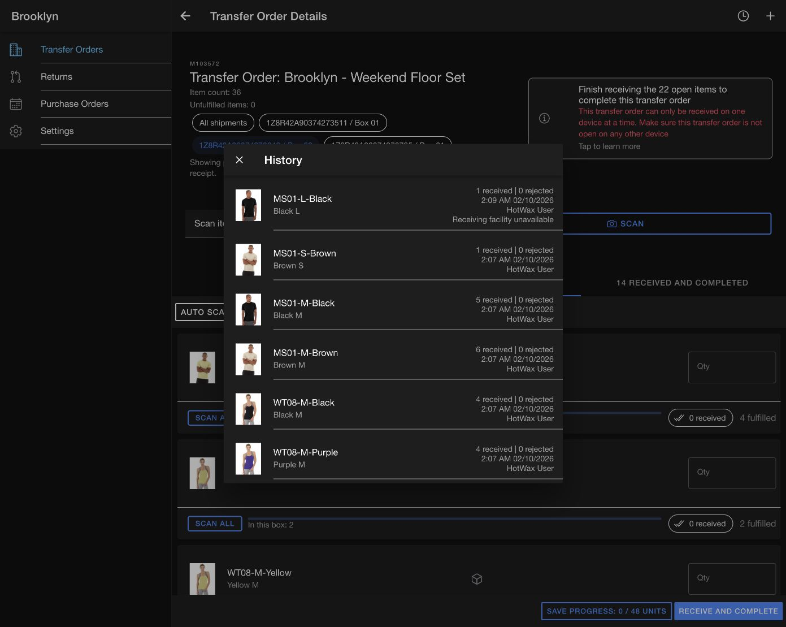
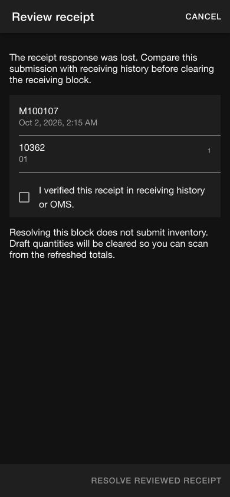

# Receiving shared-cache refactor — 2026-10-02

Tested Receiving on `codex/receiving-cache-performance`, against unchanged AccxUI `c91b85dbcbcc74fad454a38bf64615a2ff30ad9c`. The refactor starts at Receiving `ab1980e8ec97818f54143077a02d7f54fcce4f03`; earlier performance and item-count changes are already on this PR. Browser QA used the refactored checkout on localhost:8104 and the real Demo Maarg backend. No server, API, or AccxUI changes are required.

## Ownership and behavior

- AccxUI `defineEntity` / `defineSchema` / `defineAppDb` / `BaseDB` own source projections, cache schema, and opening the cache. Raw response copies are removed.
- AccxUI `createSyncService` / `createSyncHarness` own worker lifecycle, tokens, polling, domain scheduling, and errors. The custom queue, scheduler, worker RPC, and fetch client are removed.
- Receiving adapters retain API pagination/validation, indexed facility relationships, multi-table transactions, and no-change snapshot comparisons. These are business-specific responsibilities.
- Receipt submission uses the shared main-thread API client, followed by shared `refreshAfterMutation` and targeted worker readback. A successful POST is never retried because cache refresh failed.
- `syncMeta` holds disposable freshness/coverage information only. Unresolved POSTs live in a separate tenant/user-scoped receipt journal that survives cache rebuilding and logout. It is a duplicate-submission guard, not an offline write queue.
- Legacy unresolved markers are copied to the journal before removal. Confirmed operations clear after readback; uncertain operations require explicit review. Clearing the reviewed operation never sends a receipt POST.
- Confirmation captures the order, facility, baseline, and item quantities. Later live updates cannot replace the confirmed submission.
- Search joins remain transient. Source writes happen in the worker; Dexie observation and list filtering now run on the main thread. The 66-order Demo corpus took 13.4, 12.9, and 17.4 ms to read/join in three samples. This is not a large-store or physical-iPad benchmark.

## Automated and browser checks

| Check | Result |
| --- | --- |
| `VITE_APP_VERSION_CONFIG='{}' pnpm --filter receiving test:unit --run` | 42 tests pass in 10 files |
| `pnpm --filter receiving build` | Pass, 11.44 seconds; existing chunk/eval warnings |
| `pnpm exec vue-tsc --noEmit` from Receiving | Same 28 errors as an isolated `ab1980e` baseline; no new errors |
| UI diff checker and `git diff --check` | Pass |
| Real Chromium IndexedDB: database | 21 assertions pass |
| Real Chromium IndexedDB: legacy receipt migration | 24 assertions pass across legacy v1/v2/v3 |
| Real Chromium IndexedDB: shipment/tracking | 10 assertions pass |
| Real Chromium IndexedDB: performance | 9 assertions pass |
| Isolated Pinia draft behavior in Chromium | 8 assertions pass |

The browser checks use disposable IndexedDB fixtures and are separate from the unit suite and CI build. They test actual Dexie transactions, reopening, and cross-worker invalidation, not OMS behavior. With the dev app open, run each exported function from its matching `tests/*.browser.ts` module: `checkReceivingDatabase`, `checkReceivingMigration`, `checkReceivingShipments`, `checkReceivingPerformance`, and `checkReceivingDrafts`.

The performance fixture contains 20 pending lines, 2,000 archived lines, and 500 archived boxes. List joins read the 20 pending lines and one relevant box. Metadata changes cause zero corpus evaluations. Unchanged snapshots cause zero source-table writes. Barcode lookup reads zero transfer lines. Changed rows and deletions still propagate.

Fault-injection unit checks cover confirmed POST/readback failure, uncertain POST retention and explicit review, changed server baseline, startup retry, facility changes during preflight, and waiting for independent detail/history refresh after membership refresh fails. These simulated failures are not claims of live OMS failure behavior.

## Live app coverage

| Workflow | Result |
| --- | --- |
| Open list, item counts, product/tracking search, empty search | Pass; “No results found” rendered |
| Unique tracking code + Enter | Opens matching transfer with the box selected |
| Shipment filters, per-item Scan all, header Auto scan all | Pass; only visible pending lines fill |
| Offline navigation | Cached tracking search opens M103572 and selects its shipment while Chromium is offline; network restored afterward |
| Confirmation snapshot | Confirmed 2 units on M100107/01, then changed its live draft to 3 while confirmation was open; OMS received exactly 2 |
| Under/over receipt | M103572: selected 14 lines, changed 00001 to 1 against 2 issued and 00003 to 5 against 4 issued, acknowledged both discrepancies; OMS received 56 units and completed those 14 lines; 22 other lines stayed unchanged |
| Unexpected product | Added product 10049, received 1 unit; OMS returned receipt M100949; history shows it with its receiver and timestamp |
| Receipt API omission | Mis-shipped receipt has no facility in the real response. Order history now shows “Receiving facility unavailable”; it does not become a current-facility quantity |
| Server rejection | OMS rejects completing M100107/01 from ITEM_PENDING_FULFILL. No additional units were received. Known validation rejections show the returned business error and remove the local guard |
| Completed list/detail | M100103 loads received quantities; no receipt controls shown |
| Automatic completed-detail refresh | Aged M100103's local freshness metadata by three minutes; background sync refreshed it without a manual refresh |
| Facility changes | Queens showed its own list and excluded M103572; returning to Brooklyn reused its saved data |
| Real logout/login | Logged out and used the saved Demo Keychain login; list loaded without a reload or “Loading saved transfers” stall |
| Unknown receipt recovery | Injected a local QA journal record for M100107, without an inventory request; it survived logout and reload, blocked submission, and cleared only after explicit review/readback. Network capture recorded zero receipt POSTs during resolution. Fixture removed through the UI |
| Responsive review dialog | Desktop and 390×844 mobile checked; checkbox text wraps and footer remains usable |
| Settings / Create transfer | Settings rendered; creation form and origin selector opened and were cancelled |
| Purchase Orders / Returns | Open and Completed lists rendered their empty states; Demo Brooklyn had no records, so detail/submission could not be verified |

## Size change and limits

Compared with `ab1980e`, excluding this QA record and screenshots:

| Scope | Deleted lines | Added lines | Net fewer lines |
| --- | ---: | ---: | ---: |
| Production source | 607 | 596 | 11 |
| Tests | 244 | 207 | 37 |
| Total code | 851 | 803 | 48 |

Deleted `receivingQueue.ts`, `receivingSync.ts`, and their obsolete scheduling coverage (`receiving.worker.spec.ts`, `receivingSync.spec.ts`). Seven old unit cases were removed and seven receipt/lifecycle regression cases were added: total cases remain 42, with one fewer test file. Explicit entity declarations and durable receipt recovery account for much of the replacement code.

This is broad browser regression coverage, not a claim that every app path is verified. Purchase-order/return submissions lack Demo fixtures; physical Shopify POS, camera scanning, distributed receiving from different devices, and production-scale memory/latency remain untested. The backend has no new idempotency contract; ambiguous writes deliberately require review. The retained legacy cache is left untouched after journal import. Nothing has been merged or deployed by this refactor task.
